
<h1 align=center> Privacy Apps (Desktop) </h1>

<h2>Table of Contents:</h2>
<ul>
    <li><a href="#operatingSystems">Common Applications</a></li>
    <ul>
        <li><a href="#operatingSystems">Operating Systems (OS)</a></li>
        <li><a href="#webBrowsers">Web Browsers</a></li>
    </ul> 
    <li><a href="#ideText">Programming/Development Applications</a></li>
    <ul>
        <li><a href="#ideText">IDEs & Text Edtors</a></li>
    </ul>
    <li><a href="#cloudStorage">Cloud Services</a></li>
    <ul>
        <li><a href="#cloudStorage">Cloud Storage Services</a></li>
    </ul>
    <li><a href="#mailServices">Mail Services</a></li>
    <ul>
        <li><a href="#mailServices">Email Services</a></li>
    </ul>
</ul>

    

    <h2>Operating Systems (OS)</h2>
    

    <h4>Things to Avoid:</h4>
    <table>
        <tr>
            <th>Avoid</th>
            <th>Why</th>
        </tr>
        <tr>
            <th>
                Microsoft Windows
                 
                
            </th>
            <th>
                <ul>
                    <li align=left>
                        Owned by Microsoft</li>
                    <li align=left>Collects Personal Information</li>
                    <li align=left>Sells Data to External Organizations</li>
                </ul>    
            </th>  
        </tr>
        <tr>
            <th>MacOS
             
            
            </th>
            <th>
                <ul>
                    <li align=left>Owned by Apple</li>
                    <li align=left>Collects Personal Information</li>
                </ul>    
            </th>    
        </tr>
        <tr>
            <th>Chrome OS
             
            
            </th>
            <th>
                <ul>
                    <li align=left>
                        Owned by Google (Alphabet)</li>
                    <li align=left>Collects Personal Information</li>
                    <li align=left>Sells Data to External Organizations</li>
                </ul>    
            </th>
        </tr>
        <tr>
            <th>Ubuntu
             
            
            </th>
            <th>
                <ul>
                    <li align=left>Collects User Information by Default</li>
                    <li align=left>Uses Gnome (Contains Trackers)</li>
                    <li align=left>Open Source</li>
                </ul>
            </th>
        </tr>
    </table>
    <h4>Use:</h4>
    <table>
        <tr>
            <th>Try</th>
            <th>Reasons</th>
        </tr>
        <tr>
            <th>
            <a href="https://linuxmint.com/"" target="_blank">Linux Mint <i class="fa fa-external-link"></i></a>
             
            
            </th>
            <th>
                <ul>
                    <li align=left>Very Familiar Layout to Windows</li>
                    <li align=left>No Trackers</li>
                    <li align=left>Open Source</li>
                    <li align=left>Pre-Installs Everything you need off the Bat</li>
                </ul>
            </th>
        </tr>
        <tr>
            <th>
            <a href="https://archlinux.org/" target="_blank">Arch Linux <i class="fa fa-external-link"></i></a>
             
            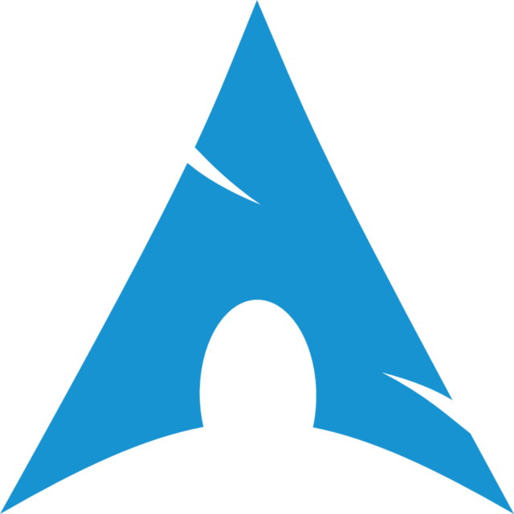
            </th>
            <th>
                <ul>
                    <li align=left>Extremely Customizable</li>
                    <li align=left>No Trackers</li>
                    <li align=left>Open Source</li>
                    <li align=left><a href="https://aur.archlinux.org/" target="_blank">AUR <i class="fa fa-external-link"></i></a> access</li>
                    <li align=left><a href="https://www.youtube.com/watch?v=DPLnBPM4DhI&t" target="_blank" >Installation Guide <i class="fa fa-external-link"></i></a></li>
                    <li align=left>⚠️Difficult Installation Process for Beginners⚠️</li>
                </ul>
            </th>
        </tr>
        <tr>
            <th>
            <a href="https://asahilinux.org/" target="_blank">Asahi Linux <i class="fa fa-external-link"></i></a>
             
            
            </th>
            <th>
                <ul>
                    <li align=left>Similar to Arch Linux</li>
                    <li align=left>No Trackers</li>
                    <li align=left>Open Source</li>
                    <li align=left><a href="https://aur.archlinux.org/" target="_blank">AUR <i class="fa fa-external-link"></i></a> access</li>
                    <li align=left>Works with Apple Silicon (M1 & M2 Macbooks)</li>
                    <li align=left>Simple Installation</li>
                    <li align=left>⚠️Still a Work in Progress⚠️</li>
                </ul>
            </th>
        </tr>
        <tr>
            <th>
            <a href="https://getfedora.org/" target="_blank">Fedora <i class="fa fa-external-link"></i></a>
             
            
            </th>
            <th>
                <ul>
                    <li align=left>It's a "Just Works Distro"</li>
                    <li align=left>No Trackers</li>
                    <li align=left>Open Source</li>
                    <li align=left>Pre-Installs Everything you need off the Bat</li>
                    <li align=left>⚠️Uses Gnome (Contains Trackers)⚠️</li>
                </ul>
            </th>
        </tr>
        <tr>
            <th>
            <a href="https://reactos.org/ target="_blank"">React OS <i class="fa fa-external-link"></i></a>
             
            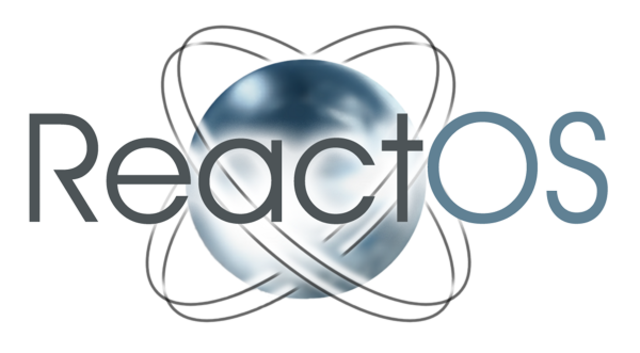
            </th>
            <th>
                <ul>
                    <li align=left>If you HAVE to use Windows use this</li>
                    <li align=left>Installs .exe & .msi Files</li>
                    <li align=left>Has a Software Center</li>
                    <li align=left>Open Source</li>
                    <li align=left>
                        ⚠️Only Suports 32-bit Architectures⚠️
                    </li>
                </ul>
            </th>
        </tr>
    </table>

 

    

    <h2>Web Browsers</h2>
    

    <table>
        <tr>
            <th>Avoid</th>
            <th>Why</th>
        </tr>
        <tr>
            <th>
                Google Chrome
                 
                
            </th>
            <th>
                <ul>
                    <li align=left>
                        Owned by Google (Alphabet)</li>
                    <li align=left>Collects Personal Information</li>
                    <li align=left>Sells Data to External Organizations</li>
                    <li align=left>Uses Chromium</li>
                </ul>    
            </th>
        </tr>
        <tr>
            <th>
            Safari
             
            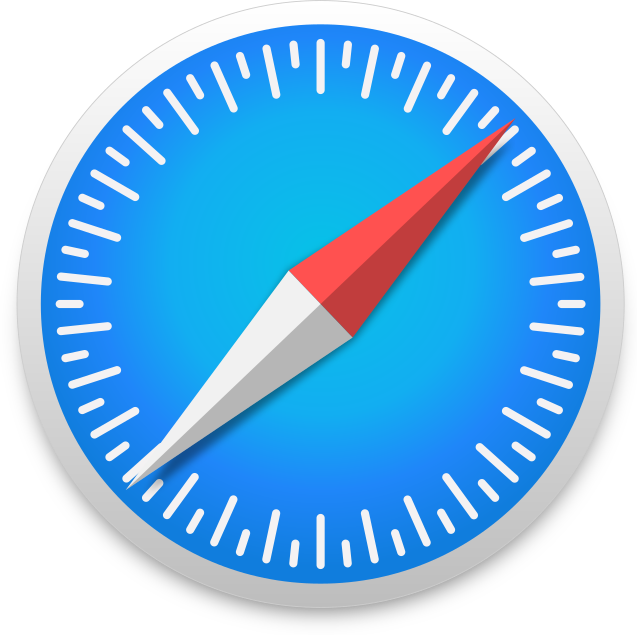
            </th>
            <th>
                <ul>
                    <li align=left>Owned by Apple</li>
                    <li align=left>Collects Personal Information</li>
                    <li align="left">Uses the Outdated Webkit Engine</li>
                </ul>    
            </th>
        </tr>
        <tr>
            <th>
            Opera
             
            
            </th>
            <th>
                <ul>
                    <li align=left>
                        Aquirred by a Chinese Consortium</li>
                    <li align=left>Collects Personal Information</li>
                    <li align=left>Sells Data to External Organizations</li>
                    <li align=left>Uses Chromium</li>
                    <li align=left>Has a built-in VPN</li>
                </ul>    
            </th>
        </tr>
        <tr>
            <th>Microsoft Edge
             
            
            </th>
            <th>
                <ul>
                    <li align=left>Owned by Microsoft</li>
                    <li align=left>Collects User Information by Default</li>
                    <li align=left>Uses Chromium</li>
                </ul>
            </th>
        </tr>
    </table>
    <h4>Use</h4>
    <table>
        <tr>
            <th>Try</th>
            <th>Reasons</th>
        </tr>
        <tr>
            <th>
            <a href="https://www.torproject.org/" target="_blank">Tor <i class="fa fa-external-link"></i></a>
             
            
            </th>
            <th>
                <ul>
                    <li align=left>Able to Access Deep Web (.onion Links)</li>
                    <li align=left>Extremely Secure</li>
                    <li align=left>Based on Firefox</li>
                    <li align=left>Extremely Private</li>
                    <li align=left>Open Source</li>
                    <li align=left>Contains Both Proxy and VPN</li>
                    <li align=left>⚠️A Little Bit Slow (1-2 sec. wait time)⚠️</li>
                </ul>
            </th>
        </tr>
        <tr>
            <th>
            <a href="https://librewolf.net/" target="_blank">Librewolf <i class="fa fa-external-link"></i></a>
             
            
            </th>
            <th>
                <ul>
                    <li align=left>Based on Firefox</li>
                    <li align=left>No Tracking</li>
                    <li align=left>Privacy-Focused</li>
                    <li align=left>Open Source</li>
                    <li align=left>⚠️Difficult or Broken Installation Process⚠️</li>
                </ul>
            </th>
        </tr>
        <tr>
            <th>
            <a href="https://github.com/ungoogled-software/ungoogled-chromium" target="_blank">Ungoogled Chromium <i class="fa fa-external-link"></i></a>
             
            
            </th>
            <th>
                <ul>
                    <li align=left>Open Source</li>
                    <li align=left>Similar to Chrome (De-Googled)</li>
                    <li align=left>⚠️Lacks a few security features⚠️</li>
                </ul>
            </th>
        </tr>
        <tr>
            <th>
            <a href="https://brave.com/" target="_blank">Brave <i class="fa fa-external-link"></i></a>
             
            
            <th>
                <ul>
                    <li align=left>Privacy Focused</li>
                    <li align=left>Built-in Adblock</li>
                    <li align=left>Open Source</li>
                    <li align=left>⚠️Uses Chromium⚠️</li>
                </ul>
            </th>
        </tr>
        <tr>
            <th>
            <a href="https://www.mozilla.org/en-US/firefox/new/" target="_blank">Mozilla Firefox <i class="fa fa-external-link"></i></a>
             
            
            </th>
            <th>
                <ul>
                    <li align=left>Open Source </li>
                    <li align=left>More Private than Chromium-Based Browsers</li>
                    <li align=left>Uses The Quantum & Gecko Render Engine</li>
                    <li align=left>Linux, BSD, Haiku, Windows, & MacOS Support</li>
                    <li align=left>⚠️Has Trackers⚠️</li>
                </ul>
            </th>
        </tr>
    </table>

    

    <h2>IDEs & Text Editors</h2>
    

    <table>
        <tr>
            <th>Avoid</th>
            <th>Why</th>
            <th>Rating</tr>
        </tr>
        <tr>
            <th>
            Visual Studio Code (VSCode)
             
            
            </th>
            <th>
                <ul>
                    <li align=left>Open Source</li>
                    <li align=left>Owned by Microsoft</li>
                    <li align=left>Has Telementry</li>
                    <li align=left>Built on Electron JS</li>
                </ul>
            </th>
        </tr>
    </table>
    <h4>Use</h4>
    <table>
        <tr>
            <th>Try</th>
            <th>Reasons</th>
        </tr>
        <tr>
            <th>
            <a href="https://neovim.io/" target="_blank">Neovim <i class="fa fa-external-link"></i></a>
             
            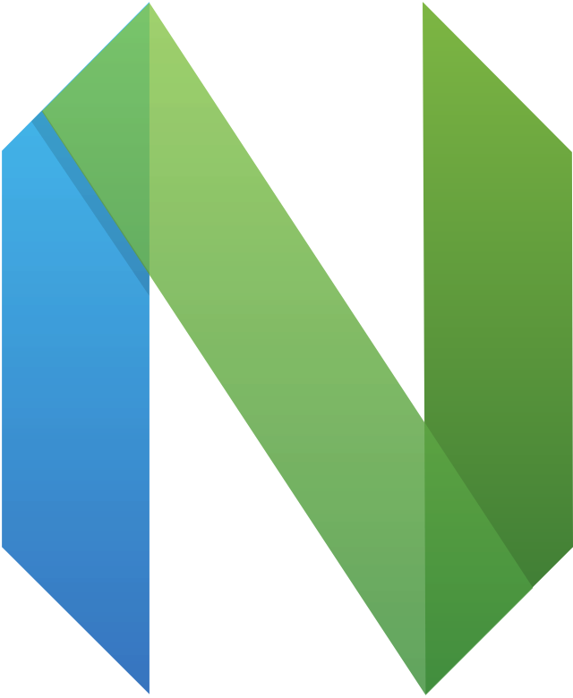
            </th>
            <th>
                <ul>
                    <li align=left>Faster than Regular Vim</li>
                    <li align=left>Open Source</li>
                    <li align=left>No Trackers</li>
                    <li align=left>⚠️A Bit of a Learning Curve⚠️</li>
                </ul>
            </th>
        </tr>
        <tr>
            <th>
            <a href="https://www.gnu.org/software/emacs/" target="_blank">GNU Emacs <i class="fa fa-external-link"></i></a>
             
            
            </th>
            <th>
                <ul>
                    <li align=left>The OG IDE</li>
                    <li align=left>Open Source</li>
                    <li align=left>No Trackers</li>
                    <li align=left>⚠️A Bit of a Learning Curve⚠️</li>
                    <li align=left>⚠️Takes Time to Fully Set-Up⚠️</li>
                </ul>
            </th>
        </tr>
        <tr>
            <th>
            <a href="https://www.vim.org/" target="_blank">Vim <i class="fa fa-external-link"></i></a>
             
            
            </th>
            <th>
                <ul>
                    <li align=left>One of the OG Editors</li>
                    <li align=left>Open Source</li>
                    <li align=left>No Trackers</li>
                    <li align=left>⚠️A Bit of a Learning Curve⚠️</li>
                </ul>
            </th>
        </tr>
        <tr>
            <th>
            <a href="https://pulsar-edit.dev/" target="_blank">Pulsar Editor <i class="fa fa-external-link"></i></a>
             
            
            </th>
            <th>
                <ul>
                    <li align=left>Similar to Github's Aton IDE</li>
                    <li align=left>Open Source</li>
                    <li align=left>No Trackers</li>
                    <li align=left>No Telemetry</li>
                    <li align=left>Has a Package manager</li>
                    <li align=left>⚠️Uses Electron JS⚠️</li>
                </ul>
            </th>
        </tr>
        <tr>
            <th>
            <a href="https://www.nano-editor.org/ target="_blank"">GNU Nano <i class="fa fa-external-link"></i></a>
             
            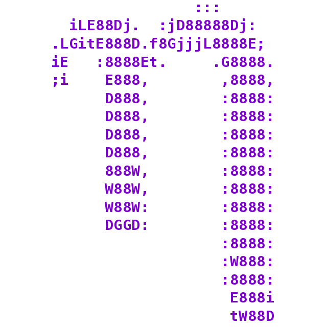
            </th>
            <th>
                <ul>
                    <li align=left>One of the OG Editors</li>
                    <li align=left>Very Simple</li>
                    <li align=left>Open Source</li>
                    <li align=left>No Trackers</li>
                    <li align=left>⚠️Not Extensible⚠️</li>
                </ul>
            </th>
        </tr>
        <tr>
            <th>
            <a href="https://notepad-plus-plus.org/downloads/" target="_blank">Notepad++ <i class="fa fa-external-link"></i></a>
             
            
            </th>
            <th>
                <ul>
                    <li align=left>Open Source</li>
                    <li align=left>No Trackers</li>
                    <li align=left>No Telemetry</li>
                    <li align=left>Extremely Lightweight</li>
                </ul>
            </th>
        </tr>
        <tr>
            <th>
            <a href="https://vscodium.com/" target="_blank">VSCodium <i class="fa fa-external-link"></i></a>
             
            
            </th>
            <th>
                <ul>
                    <li align=left>Exact Same as VSCode</li>
                    <li align=left>Open Source</li>
                    <li align=left>No Trackers</li>
                    <li align=left>No Telemetry</li>
                    <li align=left>⚠️Uses Electron JS⚠️</li>
                </ul>
            </th>
        </tr>
    </table>

    

    <h2>Cloud Storage</h2>
    

    <table>
        <tr>
            <th>Avoid</th>
            <th>Why</th>
        </tr>
        <tr>
            <th>
                Google Drive
                 
                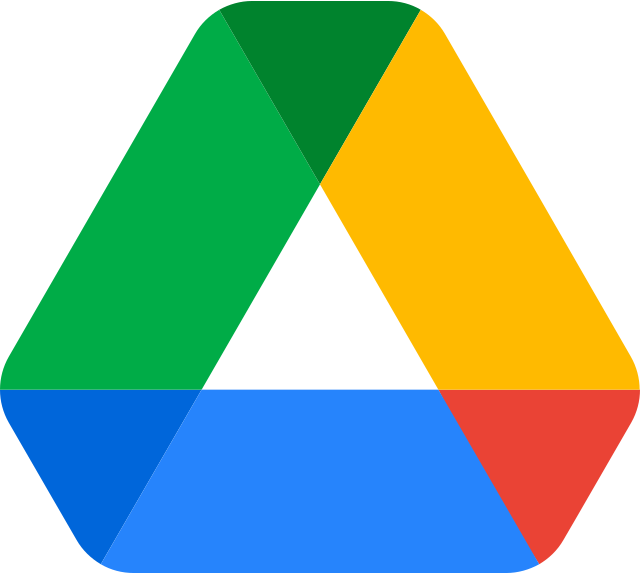
            </th>
            <th>
                <ul>
                    <li align=left>
                        Owned by Google (Alphabet)</li>
                    <li align=left>Collects Personal Information</li>
                    <li align=left>Sells Data to External Organizations</li>
                </ul>    
            </th>
        </tr>
        <tr>
            <th>
            iCloud
             
            
            </th>
            <th>
                <ul>
                    <li align=left>Owned by Apple</li>
                    <li align=left>Collects Personal Information</li>
                    <li align="left">Pretty Secure</li>
                </ul>    
            </th>
        </tr>
        <tr>
            <th>
            OneDrive
             
            
            </th>
            <th>
                <ul>
                    <li align=left>Owned by Microsoft</li>
                    <li align=left>Collects Personal Information</li>
                    <li align=left>Sells Data to External Organizations</li>
                </ul>    
            </th>
        </tr>
        <tr>
            <th>
            Dropbox
             
            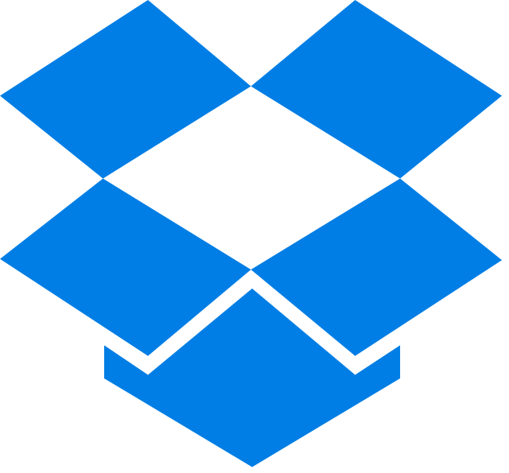
            </th>
            <th>
                <ul>
                    <li align=left>Collects User Information</li>
                </ul>
            </th>
        </tr>
        <tr>
            <th>
            Mega
             
            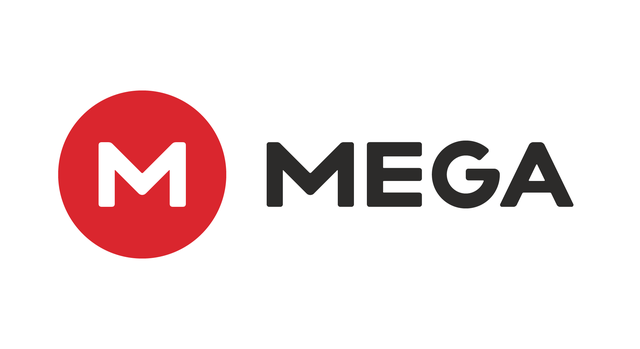
            </th>
            <th>
                <ul>
                    <li align=left>Collects User Information</li>
                </ul>
            </th>
        </tr>
    </table>
    <h4>Use</h4>
    <table>
        <tr>
            <th>Try</th>
            <th>Reasons</th>
        </tr>
        <tr>
            <th>
            <a href="https://owncloud.com/" target="_blank">OwnCloud <i class="fa fa-external-link"></i></a>
             
            
            </th>
            <th>
                <ul>
                    <li align=left>Self Hosted</li>
                    <li align=left>Open Source</li>
                    <li align=left>Very Secure</li>
                </ul>
            </th>
        </tr>
        <tr>
            <th>
            <a href="https://syncthing.net/ target="_blank"">Syncthing <i class="fa fa-external-link"></i></a>
             
            
            </th>
            <th>
                <ul>
                    <li align=left>Most Secure</li>
                    <li align=left>Free</li>
                    <li align=left>Open Source</li>
                </ul>
            </th>
        </tr>
        <tr>
            <th>
            <a href="https://nextcloud.com/" target="_blank">Nextcloud <i class="fa fa-external-link"></i></a>
             
            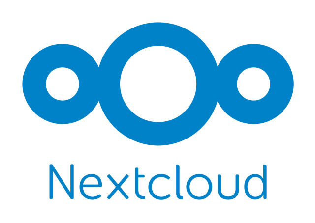
            </th>
            <th>
                <ul>
                    <li align=left>Open Source</li>
                    <li align=left>Based on OwnCloud</li>
                    <li align=left>Has an Entire Office Suite</li>
                    <li align=left>Self Hosted</li>
                </ul>
            </th>
        </tr>
        <tr>
            <th>
            <a href="https://proton.me/drive" target="_blank">Proton Drive <i class="fa fa-external-link"></i></a>
             
            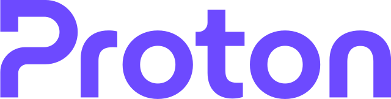
            </th>
            <th>
                <ul>
                    <li align=left>Privacy Focused</li>
                    <li align=left>Open Source</li>
                    <li align=left>Tor/Onion <a href="https://protonmailrmez3lotccipshtkleegetolb73fuirgj7r4o4vfu7ozyd.onion/" target="_blank">Link <i class="fa fa-external-link"></i></a></li>
                    <li align=left>⚠️Proton has Reported Activists to Authorties <a href="https://www.theverge.com/2021/9/6/22659861/protonmail-swiss-court-order-french-climate-activist-arrest-identification" target="_blank">News Article <i class="fa fa-external-link"></i></a>⚠️ </li>
                </ul>
            </th>
        </tr>
    </table>

    

    <h2>Email Services</h2>
    

    <table>
        <tr>
            <th>Avoid</th>
            <th>Why</th>
        </tr>
        <tr>
            <th>Gmail
             
            
            </th>
            <th>
                <ul>
                    <li align=left>Owned by Google (Alphabet)</li>
                    <li align=left>Collects & Sells User Data to External Organizations</li>
                </ul>
            </th>
        </tr>
        <tr>
            <th>Microsoft Outlook
             
            
            </th>
            <th>
                <ul>
                    <li align=left>Owned by Microsoft</li>
                    <li align=left>Collects & Sells User Data to External Organizations</li>
                </ul>
            </th>
        </tr>
    </table>
    <h4>Use</h4>
    <table>
        <tr>
            <th>Try</th>
            <th>Reasons</th>
        </tr>
        <tr>
            <th><a href="https://mailinabox.email/">Mail-in-a-Box <i class="fa fa-external-link"></i></a>
             
            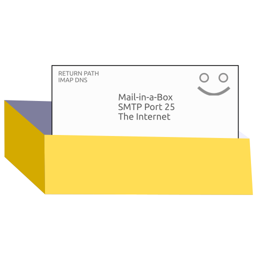</th>
            <th>
                <ul>
                    <li align=left>Self Hosted</li>
                    <li align=left>Simple Installation Process</li>
                    <li align=left>Automated Setup Process</li>
                    <li align=left>Open Source</li>
                    <li align=left>⚠️You Need a Registered Domain⚠️</li>
                </ul>
            </th>
        </tr>
        <tr>
            <th><a href="https://mailcow.email/">Mailcow <i class="fa fa-external-link"></i></a>
             
            
            </th>
            <th>
                <ul>
                    <li align=left>Self Hosted</li>
                    <li align=left>More Options for OS</li>
                    <li align=left>Open Source</li>
                    <li align=left>⚠️You Need a Registered Domain⚠️</li>
                </ul>
            </th>
        </tr>
        <tr>
            <th><a href="https://tutanota.com/">Tutunota <i class="fa fa-external-link"></i></a>
             
            
            </th>
            <th>
                <ul>
                    <li align=left>Open Source</li>
                    <li align=left>No Tracking</li>
                </ul>
            </th> 
        </tr>
        <tr>
            <th>
            <a href="https://proton.me/" target="_blank">Proton Mail <i class="fa fa-external-link"></i></a>
             
            </th>
            <th>
                <ul>
                    <li>Open Source</li>
                    <li>Privacy Focused</li>
                    <li align=left>Tor/Onion <a href="https://protonmailrmez3lotccipshtkleegetolb73fuirgj7r4o4vfu7ozyd.onion/" target="_blank">Link <i class="fa fa-external-link"></i></a></li>
                    <li align=left>⚠️Proton has Reported Activists to Authorties <a href="https://www.theverge.com/2021/9/6/22659861/protonmail-swiss-court-order-french-climate-activist-arrest-identification" target="_blank">News Article <i class="fa fa-external-link"></i></a>⚠️ </li>
                </ul>
            </th>
        </tr>
    </table>

